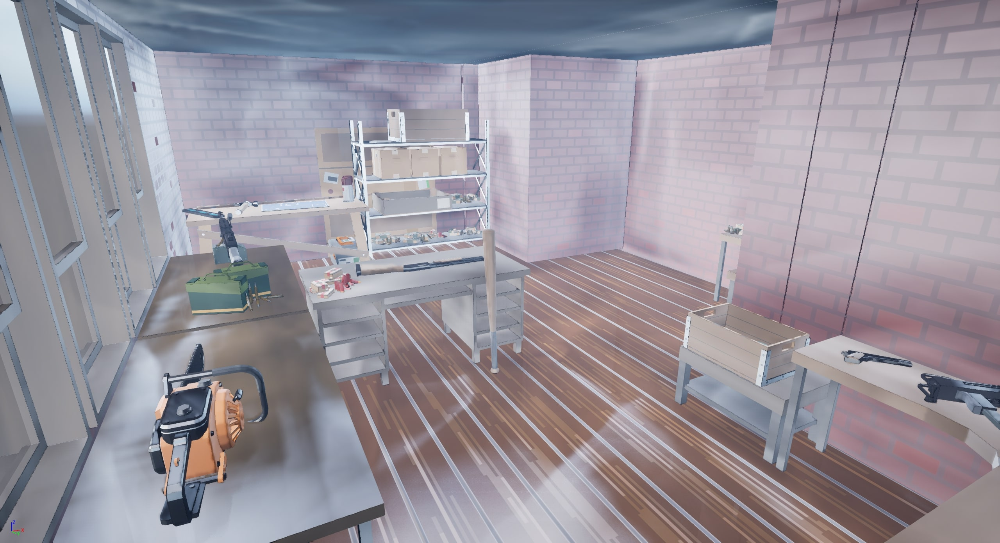
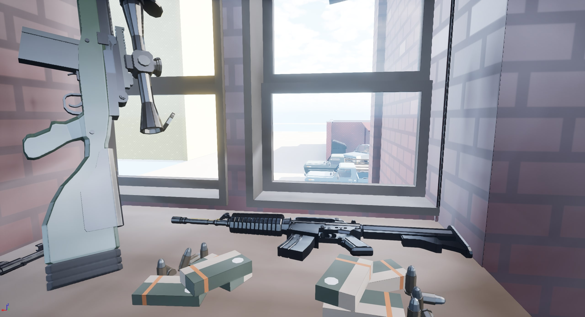
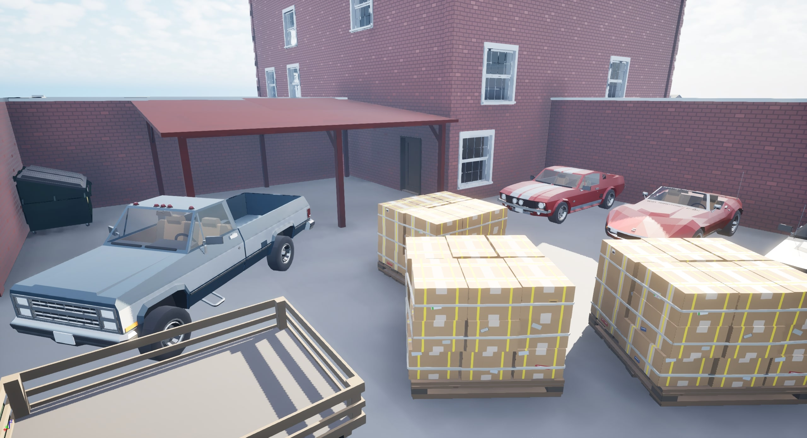
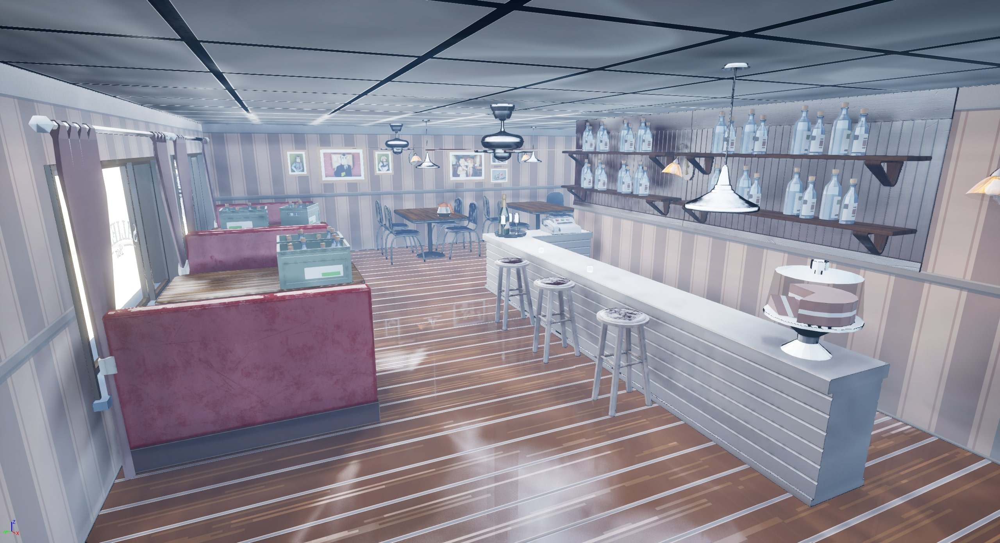
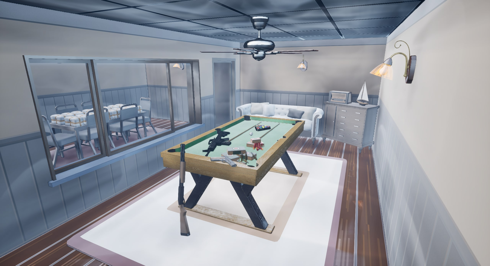
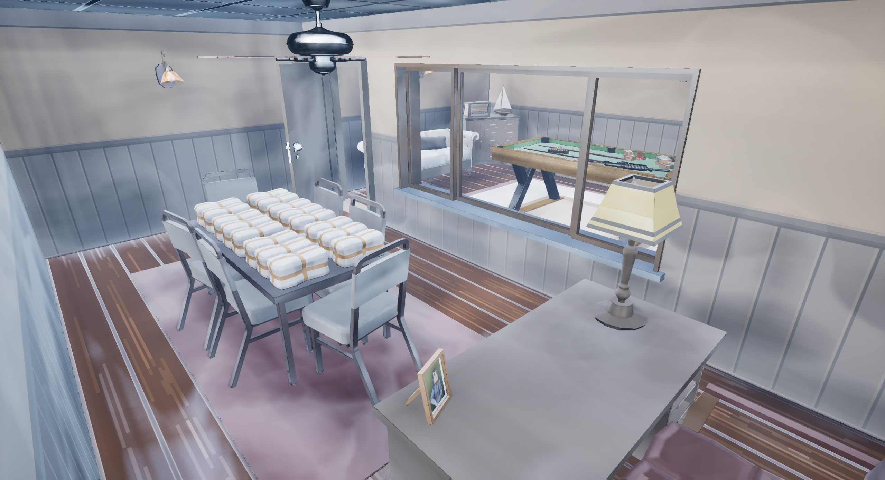
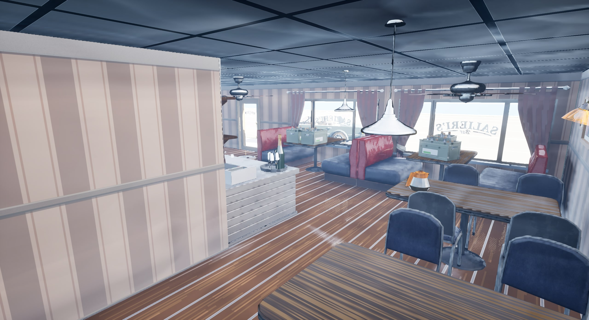
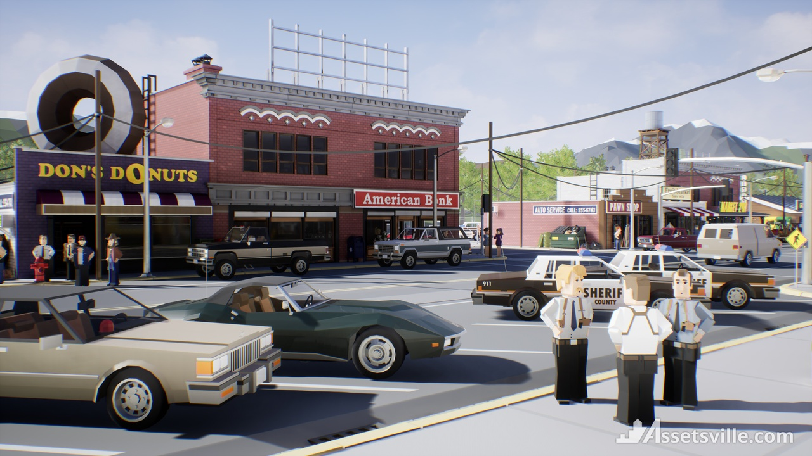

# Salieri's Bar in Unreal Engine 5

This is an attempt at recreating the iconic Salieri's Bar from the first **[Mafia](https://store.steampowered.com/app/40990/Mafia/)** game.

## Screens

  
  
  
  
  
  

## Assets Used

### **[Assetsville Town](https://www.fab.com/listings/fd558d8c-bd7e-461f-8449-a7cc9c277078)**

